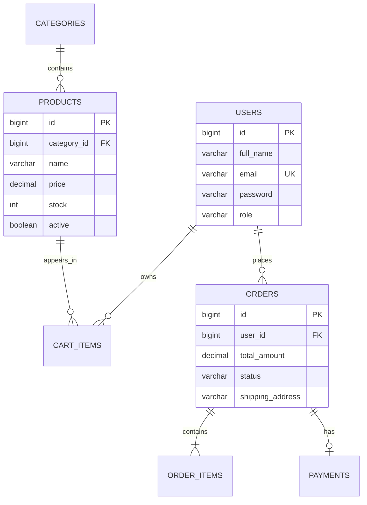

# Java Spring Boot E-Commerce Backend System

A complete e-commerce REST API built with Java 21, Spring Boot, Spring Security,
JWT authentication, Spring Data JPA, PostgreSQL/MySQL, and Maven.

## Project Overview

This backend supports the core workflow of an online store: customers can create
accounts, browse and search the catalog, manage a cart, place orders, and review
their order history. Administrators can manage categories and products, inspect
users and orders, and move orders through a controlled fulfillment lifecycle.

## Features

- JWT registration and login with BCrypt password hashing
- `USER` and `ADMIN` role-based authorization
- Paginated product browsing, search, and category filtering
- Category and product administration
- Per-user carts with quantity and stock validation
- Transactional checkout with pessimistic stock locking
- Immutable product name and price snapshots in order items
- Order history and guarded status transitions
- Profile viewing and updates
- Consistent validation and JSON error responses
- OpenAPI 3 documentation with Swagger UI
- PostgreSQL, MySQL, H2 development, Docker, Postman, and GitHub Actions support

## Tech Stack

| Area | Technology |
| --- | --- |
| Language | Java 21 |
| Framework | Spring Boot 4.0.6 |
| Security | Spring Security, JWT (JJWT 0.13.0), BCrypt |
| Persistence | Spring Data JPA, Hibernate |
| Databases | PostgreSQL, MySQL, H2 |
| API docs | springdoc-openapi 3.0.3 / Swagger UI |
| Build | Maven Wrapper |
| Testing | JUnit 5, MockMvc, H2 |
| Delivery | Docker, Docker Compose, GitHub Actions |

## Database Design



Products are soft-deleted so an existing cart can reject an unavailable item
cleanly and historical orders remain intact. Order items store product and price
snapshots rather than depending on mutable catalog values.

## API Endpoints

### Public

| Method | Endpoint | Description |
| --- | --- | --- |
| `POST` | `/api/auth/register` | Register and receive a JWT |
| `POST` | `/api/auth/login` | Log in and receive a JWT |
| `GET` | `/api/products` | Browse/search products |
| `GET` | `/api/products/{id}` | View one product |
| `GET` | `/api/categories` | List categories |

### Customer

| Method | Endpoint | Description |
| --- | --- | --- |
| `GET` | `/api/users/me` | View profile |
| `PUT` | `/api/users/me` | Update profile |
| `POST` | `/api/cart/add` | Add a product |
| `GET` | `/api/cart` | View cart and totals |
| `PUT` | `/api/cart/{itemId}` | Change quantity |
| `DELETE` | `/api/cart/{itemId}` | Remove an item |
| `POST` | `/api/orders` | Place an order |
| `GET` | `/api/orders/my-orders` | View order history |

### Admin

| Method | Endpoint | Description |
| --- | --- | --- |
| `POST` | `/api/admin/products` | Add product |
| `PUT` | `/api/admin/products/{id}` | Update product |
| `DELETE` | `/api/admin/products/{id}` | Soft-delete product |
| `POST` | `/api/admin/categories` | Add category |
| `PUT` | `/api/admin/categories/{id}` | Update category |
| `DELETE` | `/api/admin/categories/{id}` | Delete unused category |
| `GET` | `/api/admin/users` | View users |
| `GET` | `/api/admin/orders` | View orders |
| `PUT` | `/api/admin/orders/{id}/status` | Update order status |

Use `Authorization: Bearer <token>` for customer and admin endpoints. Pagination
uses `page`, `size`, and `sort`; product search also accepts `search` and
`categoryId`.

## How to Run

### Fast local development with H2

Requirements: Java 21 or newer. Maven does not need to be installed.

```bash
./mvnw spring-boot:run -Dspring-boot.run.profiles=dev
```

On Windows:

```powershell
.\mvnw.cmd spring-boot:run "-Dspring-boot.run.profiles=dev"
```

The API starts at `http://localhost:8080`. H2 Console is available at
`http://localhost:8080/h2-console` with JDBC URL
`jdbc:h2:file:./data/ecommerce`, username `sa`, and an empty password.

### PostgreSQL with Docker

Create environment values from `.env.example`. `JWT_SECRET` must be Base64 and
decode to at least 32 bytes.

```bash
cp .env.example .env
docker compose up --build
```

The optional `ADMIN_EMAIL` and `ADMIN_PASSWORD` values create the initial admin
once. No default admin credentials are stored in source control.

### MySQL

Create an `ecommerce` database, then run:

```bash
export DB_USERNAME=ecommerce
export DB_PASSWORD=your-password
export JWT_SECRET="$(openssl rand -base64 48)"
./mvnw spring-boot:run -Dspring-boot.run.profiles=mysql
```

## API Documentation

After starting the application:

- Swagger UI: `http://localhost:8080/swagger-ui.html`
- OpenAPI JSON: `http://localhost:8080/v3/api-docs`
- Postman: import `postman_collection.json`

The Postman login and registration requests automatically store the returned
JWT in the collection's `token` variable. Log in as the bootstrapped admin before
running admin requests.

## Tests

```bash
./mvnw verify
```

Tests use an isolated in-memory H2 database and cover application startup,
registration/login, public catalog access, and protected-route security.

## Project Structure

```text
src/main/java/com/shahid/ecommerce/
|-- config/          Security, OpenAPI, and admin bootstrap
|-- controller/      Customer and public REST controllers
|   `-- admin/       ADMIN-only REST controllers
|-- dto/             Validated request and response records
|-- exception/       API errors and global exception handling
|-- model/           JPA entities and enums
|-- repository/      Spring Data repositories
|-- security/        JWT filter and user authentication
|-- service/         Service contracts and mapping
`-- service/impl/    Transactional business logic
```

## Future Improvements

- Stripe payment intents and webhook verification
- Email verification and password reset
- Object-storage product image uploads
- Coupons, promotions, and tax calculation
- Shipment tracking and customer cancellation rules
- Flyway database migrations
- Redis caching and refresh-token rotation
- React or Next.js storefront
- Cloud deployment with managed PostgreSQL

## Author

Shahid
